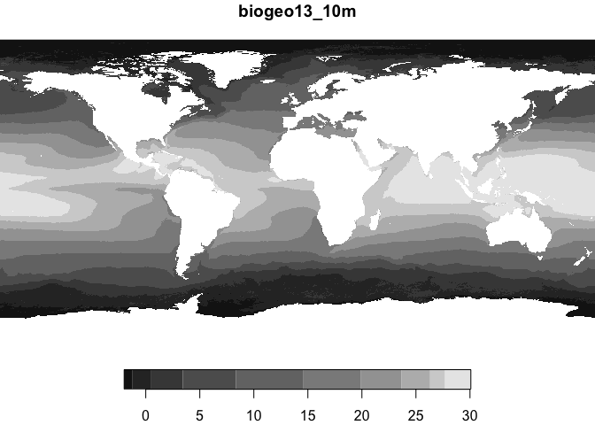
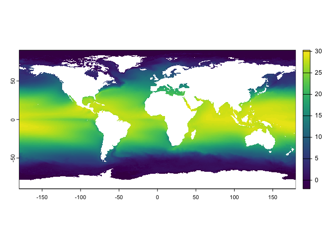

marspec
================

An R package to access and manage [MARSPEC](http://www.marspec.org/)
data. See the [MARSPEC](http://www.marspec.org/) website for details on
the data and to learn how to cite the data. The data is available via
other packages, but this package is super simple as it just downloads
and reads the data for you, and it will yield either
[stars](https://r-spatial.github.io/stars/) of
[SpatRaster](https://rspatial.org/) class raster objects - your choice.

# Requirements

- [R v4.1+](https://www.r-project.org/)
- [rlang](https://CRAN.R-project.org/package=rlang)
- [archive](https://CRAN.R-project.org/package=archive)
- [dplyr](https://CRAN.R-project.org/package=dplyr)
- [stars](https://CRAN.R-project.org/package=stars)
- [terra](https://CRAN.R-project.org/package=terra)

# Installation

    remotes::install_github("BigelowLab/marspec")

# Set your data path

Place your data in a separate directory from your current project so
thaat you can easily reuse that data in other projects. Let’s say you
planned to use a Dropbox directory for this, such as
`/Users/ben/Library/CloudStorage/Dropbox/data/marspec`. Of course, you
might have a different preferred path. You only need to do this once,
unless you decide later to change the location of your data.

``` r
suppressPackageStartupMessages({
  library(marspec)
  library(stars)
  library(terra)
})
set_root_path("/Users/ben/Library/CloudStorage/Dropbox/data/marspec")
```

# Fetch some data

Datasets are fetched by the filename you see on these pages:
[modern](https://www.esapubs.org/archive/ecol/E094/086/#data) and
[paleo](http://marspec.weebly.com/paleo-data.html). The names are not
readily apparent on the page, so you can use the `marspec_uri()`
function included with this package to list them.

``` r
names(marspec_uri())
```

    ##  [1] "MARSPEC_2o5m"            "MARSPEC_5m"             
    ##  [3] "MARSPEC_10m"             "bathymetry_30s"         
    ##  [5] "biogeo01_07_30s"         "biogeo08_17_30s"        
    ##  [7] "Sea_Ice_30s"             "Monthly_Variables_30s"  
    ##  [9] "6kya_CCSM"               "6kya_CSIRO"             
    ## [11] "6kya_ECBILTCLIOVECODE"   "6kya_FGOALS"            
    ## [13] "6kya_FOAM"               "6kya_MIROC-32"          
    ## [15] "6kya_MRI-fa"             "6kya_MRI-nfa"           
    ## [17] "6kya__Ensemble"          "21kya_CCSM"             
    ## [19] "21kya_Geophysical_Data"  "21kya_CNRM"             
    ## [21] "21kya_ECBILTCLIO"        "21kya_FGOALS"           
    ## [23] "21kya_HadCM"             "21kya_MIROC-322"        
    ## [25] "21kya__Ensemble_adjCCSM" "21kya__Ensemble_noCCSM"

You can read about these at the [MARSPEC](http://www.marspec.org/)
website.

Let’s fetch a relatively small data set for demonstration purposes.
`MARSPEC_10m` is a relatively course resolution (hence small files)
modern period data set.

    fetch_marspec("MARSPEC_10m")

Now let’s see what we have.

``` r
ff = list_marspec()
ff
```

    ##                                                                                                      bathy_10m 
    ##                "/Users/ben/Library/CloudStorage/Dropbox/data/marspec/MARSPEC_10m/Core_Variables_10m/bathy_10m" 
    ##                                                                                                   biogeo01_10m 
    ##             "/Users/ben/Library/CloudStorage/Dropbox/data/marspec/MARSPEC_10m/Core_Variables_10m/biogeo01_10m" 
    ##                                                                                                   biogeo02_10m 
    ##             "/Users/ben/Library/CloudStorage/Dropbox/data/marspec/MARSPEC_10m/Core_Variables_10m/biogeo02_10m" 
    ##                                                                                                   biogeo03_10m 
    ##             "/Users/ben/Library/CloudStorage/Dropbox/data/marspec/MARSPEC_10m/Core_Variables_10m/biogeo03_10m" 
    ##                                                                                                   biogeo04_10m 
    ##             "/Users/ben/Library/CloudStorage/Dropbox/data/marspec/MARSPEC_10m/Core_Variables_10m/biogeo04_10m" 
    ##                                                                                                   biogeo05_10m 
    ##             "/Users/ben/Library/CloudStorage/Dropbox/data/marspec/MARSPEC_10m/Core_Variables_10m/biogeo05_10m" 
    ##                                                                                                   biogeo06_10m 
    ##             "/Users/ben/Library/CloudStorage/Dropbox/data/marspec/MARSPEC_10m/Core_Variables_10m/biogeo06_10m" 
    ##                                                                                                   biogeo07_10m 
    ##             "/Users/ben/Library/CloudStorage/Dropbox/data/marspec/MARSPEC_10m/Core_Variables_10m/biogeo07_10m" 
    ##                                                                                                   biogeo08_10m 
    ##             "/Users/ben/Library/CloudStorage/Dropbox/data/marspec/MARSPEC_10m/Core_Variables_10m/biogeo08_10m" 
    ##                                                                                                   biogeo09_10m 
    ##             "/Users/ben/Library/CloudStorage/Dropbox/data/marspec/MARSPEC_10m/Core_Variables_10m/biogeo09_10m" 
    ##                                                                                                   biogeo10_10m 
    ##             "/Users/ben/Library/CloudStorage/Dropbox/data/marspec/MARSPEC_10m/Core_Variables_10m/biogeo10_10m" 
    ##                                                                                                   biogeo11_10m 
    ##             "/Users/ben/Library/CloudStorage/Dropbox/data/marspec/MARSPEC_10m/Core_Variables_10m/biogeo11_10m" 
    ##                                                                                                   biogeo12_10m 
    ##             "/Users/ben/Library/CloudStorage/Dropbox/data/marspec/MARSPEC_10m/Core_Variables_10m/biogeo12_10m" 
    ##                                                                                                   biogeo13_10m 
    ##             "/Users/ben/Library/CloudStorage/Dropbox/data/marspec/MARSPEC_10m/Core_Variables_10m/biogeo13_10m" 
    ##                                                                                                   biogeo14_10m 
    ##             "/Users/ben/Library/CloudStorage/Dropbox/data/marspec/MARSPEC_10m/Core_Variables_10m/biogeo14_10m" 
    ##                                                                                                   biogeo15_10m 
    ##             "/Users/ben/Library/CloudStorage/Dropbox/data/marspec/MARSPEC_10m/Core_Variables_10m/biogeo15_10m" 
    ##                                                                                                   biogeo16_10m 
    ##             "/Users/ben/Library/CloudStorage/Dropbox/data/marspec/MARSPEC_10m/Core_Variables_10m/biogeo16_10m" 
    ##                                                                                                   biogeo17_10m 
    ##             "/Users/ben/Library/CloudStorage/Dropbox/data/marspec/MARSPEC_10m/Core_Variables_10m/biogeo17_10m" 
    ##                                                                                                      sss01_10m 
    ##    "/Users/ben/Library/CloudStorage/Dropbox/data/marspec/MARSPEC_10m/Monthly_Variables_10m/Salinity/sss01_10m" 
    ##                                                                                                      sss02_10m 
    ##    "/Users/ben/Library/CloudStorage/Dropbox/data/marspec/MARSPEC_10m/Monthly_Variables_10m/Salinity/sss02_10m" 
    ##                                                                                                      sss03_10m 
    ##    "/Users/ben/Library/CloudStorage/Dropbox/data/marspec/MARSPEC_10m/Monthly_Variables_10m/Salinity/sss03_10m" 
    ##                                                                                                      sss04_10m 
    ##    "/Users/ben/Library/CloudStorage/Dropbox/data/marspec/MARSPEC_10m/Monthly_Variables_10m/Salinity/sss04_10m" 
    ##                                                                                                      sss05_10m 
    ##    "/Users/ben/Library/CloudStorage/Dropbox/data/marspec/MARSPEC_10m/Monthly_Variables_10m/Salinity/sss05_10m" 
    ##                                                                                                      sss06_10m 
    ##    "/Users/ben/Library/CloudStorage/Dropbox/data/marspec/MARSPEC_10m/Monthly_Variables_10m/Salinity/sss06_10m" 
    ##                                                                                                      sss07_10m 
    ##    "/Users/ben/Library/CloudStorage/Dropbox/data/marspec/MARSPEC_10m/Monthly_Variables_10m/Salinity/sss07_10m" 
    ##                                                                                                      sss08_10m 
    ##    "/Users/ben/Library/CloudStorage/Dropbox/data/marspec/MARSPEC_10m/Monthly_Variables_10m/Salinity/sss08_10m" 
    ##                                                                                                      sss09_10m 
    ##    "/Users/ben/Library/CloudStorage/Dropbox/data/marspec/MARSPEC_10m/Monthly_Variables_10m/Salinity/sss09_10m" 
    ##                                                                                                      sss10_10m 
    ##    "/Users/ben/Library/CloudStorage/Dropbox/data/marspec/MARSPEC_10m/Monthly_Variables_10m/Salinity/sss10_10m" 
    ##                                                                                                      sss11_10m 
    ##    "/Users/ben/Library/CloudStorage/Dropbox/data/marspec/MARSPEC_10m/Monthly_Variables_10m/Salinity/sss11_10m" 
    ##                                                                                                      sss12_10m 
    ##    "/Users/ben/Library/CloudStorage/Dropbox/data/marspec/MARSPEC_10m/Monthly_Variables_10m/Salinity/sss12_10m" 
    ##                                                                                                      sst01_10m 
    ## "/Users/ben/Library/CloudStorage/Dropbox/data/marspec/MARSPEC_10m/Monthly_Variables_10m/Temperature/sst01_10m" 
    ##                                                                                                      sst02_10m 
    ## "/Users/ben/Library/CloudStorage/Dropbox/data/marspec/MARSPEC_10m/Monthly_Variables_10m/Temperature/sst02_10m" 
    ##                                                                                                      sst03_10m 
    ## "/Users/ben/Library/CloudStorage/Dropbox/data/marspec/MARSPEC_10m/Monthly_Variables_10m/Temperature/sst03_10m" 
    ##                                                                                                      sst04_10m 
    ## "/Users/ben/Library/CloudStorage/Dropbox/data/marspec/MARSPEC_10m/Monthly_Variables_10m/Temperature/sst04_10m" 
    ##                                                                                                      sst05_10m 
    ## "/Users/ben/Library/CloudStorage/Dropbox/data/marspec/MARSPEC_10m/Monthly_Variables_10m/Temperature/sst05_10m" 
    ##                                                                                                      sst06_10m 
    ## "/Users/ben/Library/CloudStorage/Dropbox/data/marspec/MARSPEC_10m/Monthly_Variables_10m/Temperature/sst06_10m" 
    ##                                                                                                      sst07_10m 
    ## "/Users/ben/Library/CloudStorage/Dropbox/data/marspec/MARSPEC_10m/Monthly_Variables_10m/Temperature/sst07_10m" 
    ##                                                                                                      sst08_10m 
    ## "/Users/ben/Library/CloudStorage/Dropbox/data/marspec/MARSPEC_10m/Monthly_Variables_10m/Temperature/sst08_10m" 
    ##                                                                                                      sst09_10m 
    ## "/Users/ben/Library/CloudStorage/Dropbox/data/marspec/MARSPEC_10m/Monthly_Variables_10m/Temperature/sst09_10m" 
    ##                                                                                                      sst10_10m 
    ## "/Users/ben/Library/CloudStorage/Dropbox/data/marspec/MARSPEC_10m/Monthly_Variables_10m/Temperature/sst10_10m" 
    ##                                                                                                      sst11_10m 
    ## "/Users/ben/Library/CloudStorage/Dropbox/data/marspec/MARSPEC_10m/Monthly_Variables_10m/Temperature/sst11_10m" 
    ##                                                                                                      sst12_10m 
    ## "/Users/ben/Library/CloudStorage/Dropbox/data/marspec/MARSPEC_10m/Monthly_Variables_10m/Temperature/sst12_10m"

You can see that just one data set includes quite a few rasters.

# Read in a raster

Use that raster name to load that one raster.

``` r
x = read_marspec("biogeo13_10m")
plot(x)
```

    ## downsample set to 2

<!-- -->

## Prefer `SpatRaster`?

``` r
y = read_marspec("biogeo13_10m", form = "SpatRaster")
plot(y)
```

<!-- -->

You may be wondering just what the heck `biogeo13_10m` is. The trailing
`_10m` tells us about the resolition (10 minute). The ‘biogeo13’ refers
to a particular variable described in [this
paper](https://www.esapubs.org/archive/ecol/E095/149/metadata.php). You
can read `table 1` in here as a data frame (tibble actually).

``` r
meta = marspec_metadata() |>
  dplyr::filter(Layer.Name == "biogeo13") |>
  print()
```

    ## # A tibble: 1 × 5
    ##   Layer.Name Layer.Definition Units     Scaling.Factor Derived.from             
    ##   <chr>      <chr>            <chr>              <dbl> <chr>                    
    ## 1 biogeo13   Mean Annual SST  degrees C            100 SST monthly climatologies

Ah, annual SST mean. Got it.
